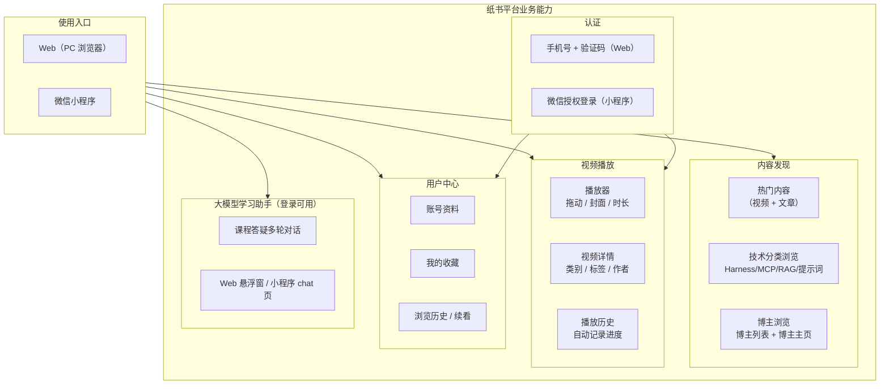
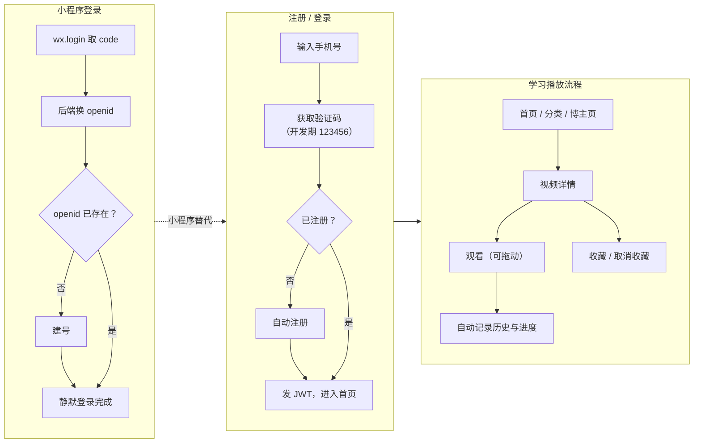
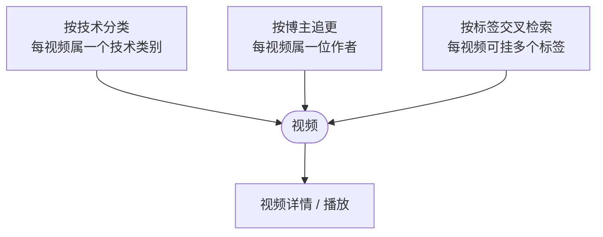
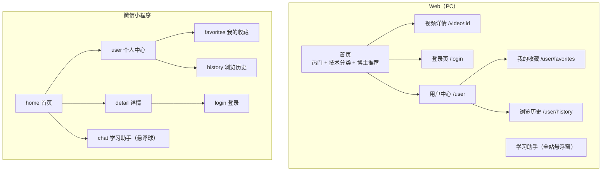
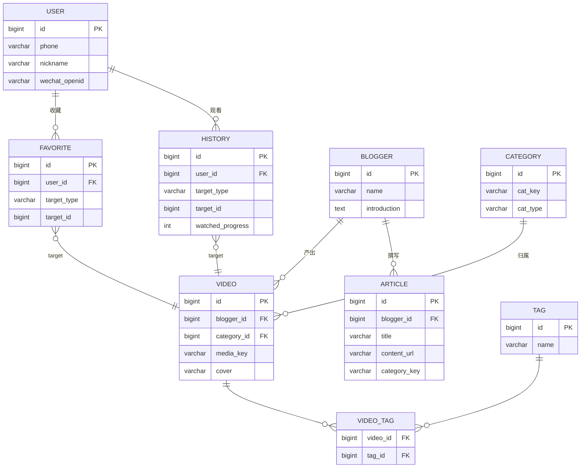

# 业务架构图（纸书 · 大模型学习平台）

> 2026-09-29 · 配套文档：[business-architecture.md](business-architecture.md)

## 1. 业务能力地图

```mermaid
flowchart TB
    subgraph Client["使用入口"]
        Web["Web（PC 浏览器）"]
        Mini["微信小程序"]
    end

    subgraph Platform["纸书平台业务能力"]
        direction TB
        subgraph Discover["内容发现"]
            Hot["热门内容<br/>（视频 + 文章）"]
            Tech["技术分类浏览<br/>Harness/MCP/RAG/提示词"]
            Blogger["博主浏览<br/>博主列表 + 博主主页"]
        end
        subgraph Play["视频播放"]
            Player["播放器<br/>拖动 / 封面 / 时长"]
            Detail["视频详情<br/>类别 / 标签 / 作者"]
            History["播放历史<br/>自动记录进度"]
        end
        subgraph UserCenter["用户中心"]
            Profile["账号资料"]
            Fav["我的收藏"]
            Hist["浏览历史 / 续看"]
        end
        subgraph Assistant["大模型学习助手（登录可用）"]
            QA["课程答疑多轮对话"]
            Float["Web 悬浮窗 / 小程序 chat 页"]
        end
        subgraph Auth["认证"]
            SmsAuth["手机号 + 验证码（Web）"]
            WxAuth["微信授权登录（小程序）"]
        end
    end

    Client --> Discover
    Client --> Play
    Client --> UserCenter
    Client --> Assistant
    Auth --> UserCenter
    Auth --> Play
```

## 2. 核心业务流程

```mermaid
flowchart LR
    subgraph Login["注册 / 登录"]
        L1["输入手机号"] --> L2["获取验证码<br/>（开发期 123456）"]
        L2 --> L3{"已注册？"}
        L3 -- 否 --> L4["自动注册"] --> L5["发 JWT，进入首页"]
        L3 -- 是 --> L5
    end

    subgraph WxLogin["小程序登录"]
        W1["wx.login 取 code"] --> W2["后端换 openid"]
        W2 --> W3{"openid 已存在？"}
        W3 -- 否 --> W4["建号"] --> W5["静默登录完成"]
        W3 -- 是 --> W5
    end

    subgraph Learn["学习播放流程"]
        P1["首页 / 分类 / 博主页"] --> P2["视频详情"]
        P2 --> P3["观看（可拖动）"]
        P3 --> P4["自动记录历史与进度"]
        P2 --> P5["收藏 / 取消收藏"]
    end

    WxLogin -. 小程序替代 .-> Login
    Login --> Learn
```

## 3. 内容的三种到达维度

```mermaid
flowchart TB
    Video(["视频"])
    C1["按技术分类<br/>每视频属一个技术类别"] --> Video
    C2["按博主追更<br/>每视频属一位作者"] --> Video
    C3["按标签交叉检索<br/>每视频可挂多个标签"] --> Video
    Video --> Page["视频详情 / 播放"]
```

## 4. 信息架构（页面结构）

```mermaid
flowchart TB
    subgraph WebPages["Web（PC）"]
        WH["首页<br/>热门 + 技术分类 + 博主推荐"]
        WD["视频详情 /video/:id"]
        WL["登录页 /login"]
        WU["用户中心 /user"]
        WF["我的收藏 /user/favorites"]
        WY["浏览历史 /user/history"]
        WA["学习助手（全站悬浮窗）"]
        WH --> WD
        WH --> WL
        WH --> WU --> WF
        WU --> WY
    end

    subgraph MiniPages["微信小程序"]
        MH["home 首页"] --> MD["detail 详情"]
        MH --> MU["user 个人中心"] --> MF["favorites 我的收藏"]
        MU --> MY["history 浏览历史"]
        MD --> ML["login 登录"]
        MH --> MC["chat 学习助手（悬浮球）"]
    end
```

## 5. 业务数据模型

```mermaid
erDiagram
    USER ||--o{ FAVORITE : "收藏"
    USER ||--o{ HISTORY : "观看"
    BLOGGER ||--o{ VIDEO : "产出"
    BLOGGER ||--o{ ARTICLE : "撰写"
    CATEGORY ||--o{ VIDEO : "归属"
    VIDEO ||--o{ VIDEO_TAG : ""
    TAG ||--o{ VIDEO_TAG : ""
    FAVORITE }o--|| VIDEO : "target"
    HISTORY }o--|| VIDEO : "target"

    USER {
        bigint id PK
        varchar phone
        varchar nickname
        varchar wechat_openid
    }
    BLOGGER {
        bigint id PK
        varchar name
        text introduction
    }
    CATEGORY {
        bigint id PK
        varchar cat_key
        varchar cat_type
    }
    VIDEO {
        bigint id PK
        bigint blogger_id FK
        bigint category_id FK
        varchar media_key
        varchar cover
    }
    TAG {
        bigint id PK
        varchar name
    }
    VIDEO_TAG {
        bigint video_id FK
        bigint tag_id FK
    }
    FAVORITE {
        bigint id PK
        bigint user_id FK
        varchar target_type
        bigint target_id
    }
    HISTORY {
        bigint id PK
        bigint user_id FK
        varchar target_type
        bigint target_id
        int watched_progress
    }
    ARTICLE {
        bigint id PK
        bigint blogger_id FK
        varchar title
        varchar content_url
        varchar category_key
    }
```
