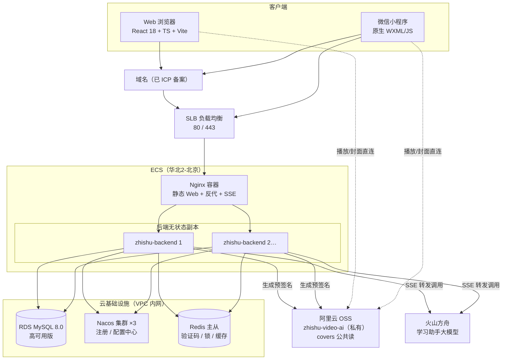
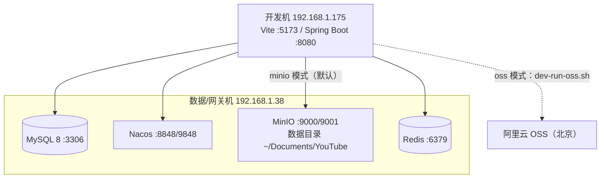
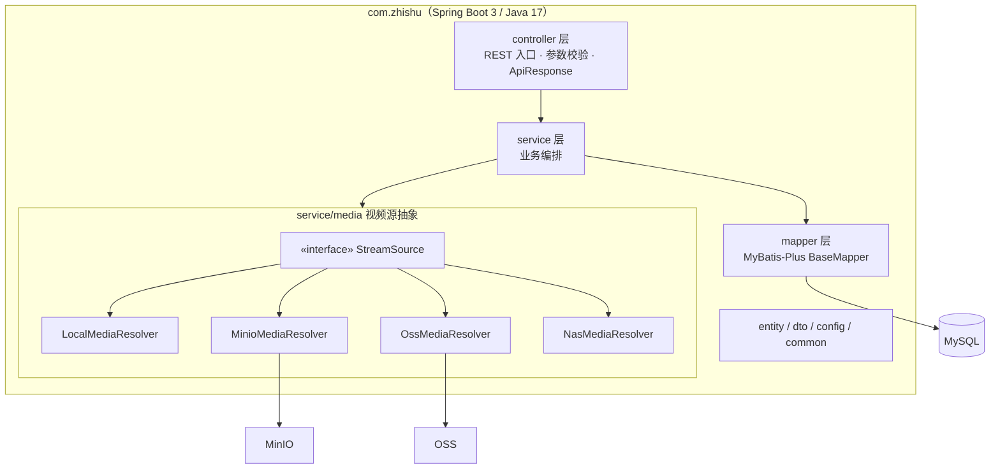
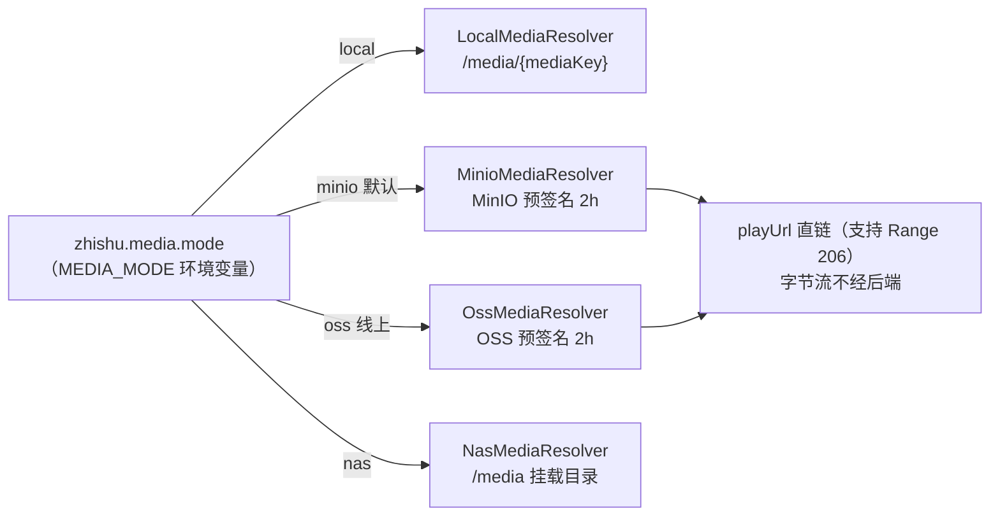
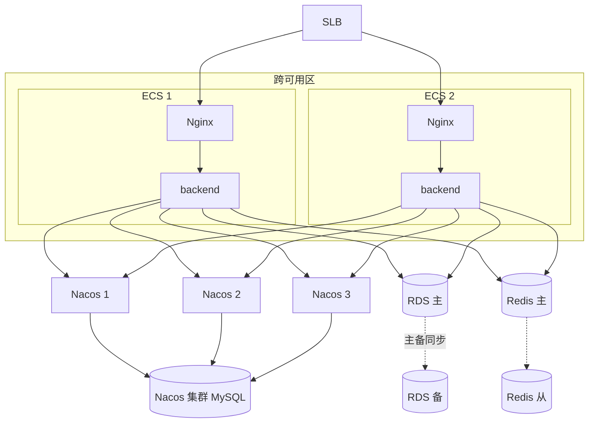
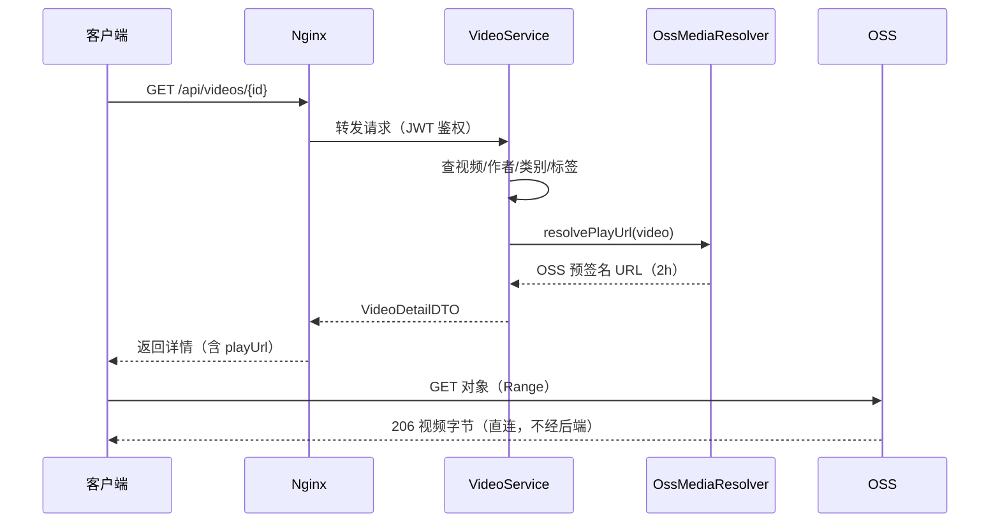
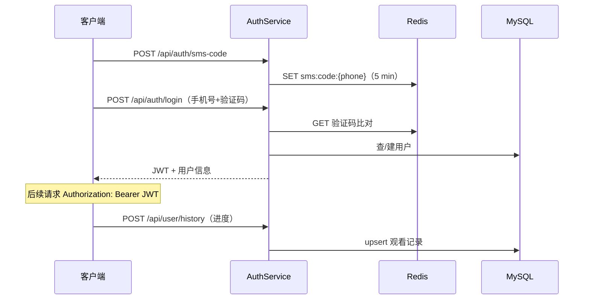

# 技术架构图（纸书 · 大模型学习平台）

> 2026-09-29 · 配套文档：[technical-architecture.md](technical-architecture.md)、部署指南：[../DEPLOY.md](../DEPLOY.md)

## 1. 总体技术架构（线上正式环境）

## 2. 本地开发环境

## 3. 后端分层架构

## 4. 视频源抽象（StreamSource）

## 5. 线上高可用部署拓扑

## 6. 核心链路：视频播放

## 7. 核心链路：登录与历史上报

